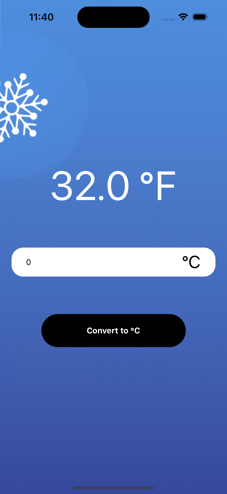
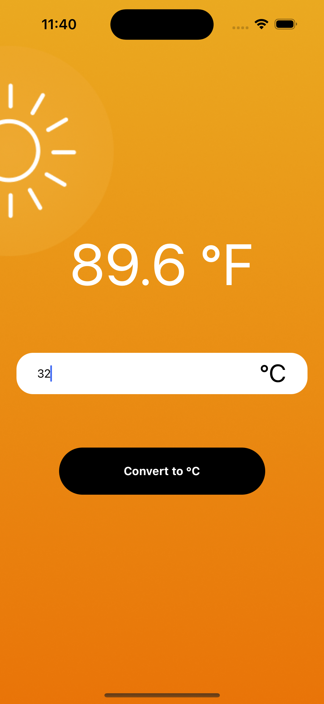

# Temperature Converter - Basic React Native Project

### Description
This is a basic **React Native** project developed as a part of my learning journey. The project demonstrates fundamental concepts of React Native, including the use of React Hooks for state management and effect handling, along with building a simple user interface.

---

## Table of Contents
1. [Features](#features)
2. [Technologies Used](#technologies-used)
3. [Getting Started](#getting-started)
4. [Screenshots](#screenshots)
5. [Installation](#installation)
6. [Usage](#usage)
7. [Acknowledgements](#acknowledgements)

---

## Features
- Basic UI components like `Text`, `View`, `TextInput`, `TouchableOpacity`, `ImageBackground`, `SafeAreaProvider`, `SafeAreaView`
- State management using `useState` hook
- Side effects handled with `useEffect`

---

## Technologies Used
- **React Native**: A framework for building native apps
- **JavaScript**: For logic and component development
- **React Hooks**: For state management (`useState`, `useEffect`)

---

## Screenshots

### IOS
<div>



</div>

### Android
<div>


</div>

---

## Getting Started

To get a local copy of this project up and running, follow these steps.

### Prerequisites
You will need the following installed on your machine:
- Node.js
- React Native CLI or Expo CLI (depending on your setup)

### Installation
1. Clone the repository:
    ```bash
    git clone https://github.com/sushanthrdy/teamperature-converter.git
    ```
2. Navigate to the project directory:
    ```bash
    cd teamperature-converter
    ```
3. Install the dependencies:
    ```bash
    npm install
    ```
    Or, if you're using yarn:
    ```bash
    yarn install
    ```

---

## Usage
1. Start the React Native development server:
    ```bash
    npm start
    ```
2. Run the app on an emulator or connected device:
    ```bash
    npm run android
    ```
    Or for iOS:
    ```bash
    npm run ios
    ```

---

## Acknowledgements
This project was created as part of my learning in the React Native : The beginner guide (2024 Edition) Course by Robin Lebhar on Udemy. Special thanks to the instructor for guiding through the fundamental concepts of React Native.
